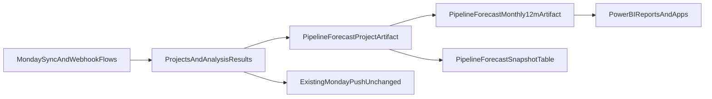

# 12-Month Forecast Implementation Plan

## Goal

- Add a parallel Power BI forecast output layer (12-month pipeline forecast) without changing existing Monday push behavior.
- Keep current webhook/rehydrate/analyze/push flow intact in [src/services/queue_worker.py](src/services/queue_worker.py), [src/tasks/pipeline.py](src/tasks/pipeline.py), and [src/services/monday_update_service.py](src/services/monday_update_service.py).

## Required Forecast Rules

- Stage bucketing must include:

```sql
case
  when pipeline_stage in ('Won - Closed (Invoiced)', 'Won - Open (Order Received)', 'Won Via Other Ref') then 'Committed'
  when pipeline_stage = 'Lost' then 'Lost'
  else 'Open'
end as stage_bucket
```

- Contract value policy must include:

```text
Use Total Order Value as contract value
Primary: projects.total_order_value.
Policy for missing values:
practical mode: fallback to new_enquiry_value until order value exists.
```

- Forecast outputs must include commit/best/worst bands.

## Architecture Shape




## Implementation Steps

### 1) Build project-level forecast artifact in SQL

- Update [src/database/schema/schema.sql](src/database/schema/schema.sql) with a new forecast artifact (view or materialized view) that joins `projects` to latest `analysis_results`.
- Include in the artifact:
  - `stage_bucket` using the required `case` expression.
  - `contract_value` with practical fallback (`coalesce(nullif(total_order_value,0), nullif(new_enquiry_value,0), 0)`).
  - Probability precedence: Lost=0, Committed=1, otherwise model probability (`analysis_results.expected_conversion_rate`) with fallback to `projects.probability_percent/100`.
  - `forecast_date` and `forecast_month` derivation for next-12-month bucketing.

### 2) Add monthly aggregate + daily snapshot persistence

- In [src/database/schema/schema.sql](src/database/schema/schema.sql):
  - Add monthly 12-month aggregate artifact (recommended materialized view) for Power BI visuals.
  - Add daily snapshot table `pipeline_forecast_snapshot` to capture per-day forecast outputs and enable drift/history analysis.
- Include snapshot columns at minimum:
  - `snapshot_date`, `project_id`, `forecast_month`, `stage_bucket`, `contract_value`, `probability`, `committed_value`, `expected_value`, `best_case_value`, `worst_case_value`, `analysis_timestamp`, `created_at`.
- Add indexes for Power BI incremental refresh and filters:
  - `(snapshot_date)`, `(forecast_month)`, `(project_id)`, and `(snapshot_date, forecast_month)`.

### 3) Define commit/best/worst band calculations

- Compute and store all bands at project level and aggregate monthly:
  - `committed_value`: contract value only for `stage_bucket='Committed'` (else 0).
  - `expected_value`: contract value × base probability.
  - `best_case_value` and `worst_case_value`: probability envelope around base probability (clamped 0..1), using conversion confidence when present and a deterministic fallback spread when absent.
- Keep formulas centralized in SQL artifact logic so Power BI and API return consistent numbers.

### 4) Wire refresh + daily snapshot jobs

- Extend [src/database/schema/functions.sql](src/database/schema/functions.sql):
  - Add/extend refresh routine to refresh forecast materialized artifacts.
  - Add a snapshot routine that inserts one daily partition/set into `pipeline_forecast_snapshot`.
- Add retention controls for snapshots:
  - Use a retention window (default 730 days; configurable) for `pipeline_forecast_snapshot`.
  - Add cleanup SQL routine in [src/database/schema/functions.sql](src/database/schema/functions.sql), e.g., `cleanup_old_pipeline_forecast_snapshots(retain_days integer default 730)`.
  - Execute cleanup after snapshot insert (or as a separate daily maintenance call) so drift history remains useful without unbounded growth.
- Update [src/tasks/postgres_maintenance.py](src/tasks/postgres_maintenance.py) to include forecast refresh steps alongside current conversion views refresh.
- Update scheduler in [src/api/app.py](src/api/app.py):
  - Keep existing jobs unchanged.
  - Add a daily forecast snapshot job (e.g., early morning UTC) and optional intraday forecast-refresh cadence.
  - Add a daily snapshot cleanup job (or chained cleanup step) using the same retention window.

### 5) Expose Power BI consumption path

- Primary path: Power BI connects directly to Supabase/Postgres forecast artifacts (`pipeline_forecast_snapshot` + monthly aggregate artifact).
- Optional API path for non-DB consumers:
  - Add read-only forecast router (new file such as [src/api/routes/forecast.py](src/api/routes/forecast.py)) with endpoints like `/forecast/pipeline?months=12` and `/forecast/snapshot`.
  - Register router in [src/api/app.py](src/api/app.py).
- Ensure this is additive and does not interfere with Monday push queues.

### 6) Validation and backtest

- Add forecast validation tests (new tests file such as [tests/test_pipeline_forecast_service.py](tests/test_pipeline_forecast_service.py) and/or SQL validation checks).
- Validate:
  - Stage bucket correctness.
  - Contract-value practical fallback behavior.
  - 12-month window clamping.
  - Commit/best/worst band monotonicity (`worst <= expected <= best`).
- Backtest against recent actuals (e.g., invoiced outcomes) and document calibration adjustments.

### 7) Docs and rollout

- Update [README.md](README.md) and [docs/automation.md](docs/automation.md) with:
  - Forecast artifact definitions and refresh cadence.
  - Power BI dataset setup and incremental refresh strategy using `snapshot_date`.
  - Snapshot retention window, cleanup schedule, and how to tune retention safely.
  - Operational notes confirming Monday push remains active and unchanged.

## Delivery Sequence

- Phase 1: SQL artifacts + snapshot table.
- Phase 2: Refresh/scheduler wiring.
- Phase 3: Power BI consumption and optional API endpoints.
- Phase 4: Backtest, calibration, and documentation.

