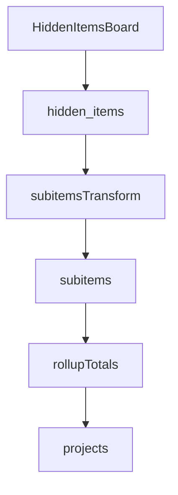

# Track Order Values From Hidden Items

## Scope and intent

- Make Hidden Items the source of truth for `Date Order Received` and `Cust Order Value Material`.
- Persist those values on subitems with reliable hidden-item fallback.
- Roll up `Total Order Value` (and optional min `Date Order Received`) onto projects via subitems during periodic syncs.

## Files to update

- [src/config.py](src/config.py)
- [src/database/schema/schema.sql](src/database/schema/schema.sql)
- [src/database/sync_service.py](src/database/sync_service.py)
- [src/webhooks/webhook_server.py](src/webhooks/webhook_server.py)
- Optional: [src/core/models.py](src/core/models.py), [src/services/analysis_service.py](src/services/analysis_service.py)

## Implementation plan

1. **Map the hidden-item columns and subitem mirror IDs**
  - Extend `HIDDEN_ITEMS_COLUMNS` with:
    - `date_order_received` → `date7__1`
    - `cust_order_value_material` → `numbers98__1`
  - Extend `SUBITEM_COLUMNS` with:
    - `cust_order_value_material` → `mirror17__1`
  - Keep `date_order_received` mapping in `SUBITEM_COLUMNS` (already `mirror226__1`).
2. **Add storage columns to Supabase schema**
  - `hidden_items` table: add `date_order_received DATE` and `cust_order_value_material NUMERIC(12,2)`.
  - `subitems` table: add `cust_order_value_material NUMERIC(12,2)`.
  - `projects` table: add `total_order_value NUMERIC(12,2)` and  `date_order_received DATE` (Rollup MIN(date_order_received)).
  - Note: add a lightweight migration note or SQL patch in `schema.sql` for existing deployments.
3. **Persist hidden-item fields during transform**
  - In `_transform_for_hidden_table`, map the two new hidden fields to the new DB columns.
  - This ensures the hidden lookup cache has authoritative values for subitem fallback.
4. **Enrich subitems with hidden fallback**
  - In `_transform_for_subitems_table`, add hidden fallback logic for:
    - `date_order_received`
    - `cust_order_value_material`
  - Follow the existing pattern used for `reason_for_change` and `quote_amount` fallback.
5. **Roll up totals to projects**
  - Add a rollup helper similar to `_rollup_new_enquiry_from_subitems` that:
    - Sums `cust_order_value_material` per `parent_monday_id`.
    - Capture min `date_order_received` per parent.
  - Apply the rollup inside `_sync_updated_items` the same way `new_enquiry_value` and gestation rollups are applied:
    - When projects are present, set `total_order_value` on the transformed project payload.
    - When only subitems changed, patch existing projects with rollup values (update-only mode).
6. **Webhook mappings and triggers (optional but recommended)**
  - Extend the column-to-table mapping in `webhook_server.py` to include:
    - `total_order_value` for projects (if stored on project rows),
    - `date_order_received` / `cust_order_value_material` for subitems (if you want webhook-driven updates).
  - Add to `ANALYSIS_TRIGGER_COLUMNS` only if these new values should auto-trigger re-analysis.
7. **Analysis model extension (optional)**
  - If these values should influence scoring/LLM features, add fields to `ProjectFeatures` and set them in `_to_project_features`.
8. **Backfill and verification**
  - Run a rehydrate flow to backfill hidden/subitems/projects.
  - Validate aggregation accuracy (sample check vs hidden items).

## Notes / design choices

- Rollups should use subitems derived from hidden items, not the parent mirror fields.
- Prefer update-only patching when only subitems change to keep periodic sync efficient.

## Mermaid flow (high level)

