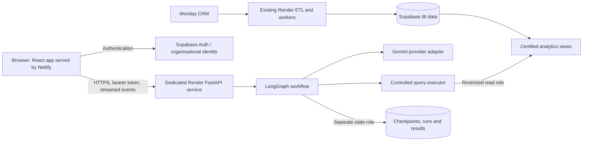

**DataCube natural-language BI analyst: phased implementation plan**

Prepared: 7 October 2026. Repository baseline reviewed: `9a62b35`.

## Business-definition correction: 8 October 2026

The following owner clarification supersedes the original Phase 1/2 population,
monthly revenue and Order Value requirements:

- **Current analytical population:** use projects/items whose current Monday API
  lifecycle `state` is `active`. This is not a board business-status label.
  `reportable_projects` and its placeholder classifications are not the eligibility
  authority; the owner confirms that feature is not fully implemented. Do not
  exclude an otherwise active item solely through that feature. Verify current
  child membership and the API state of contributing child/hidden items as well.
  Missing, stale or unreadable state evidence is a coverage gap, not proof of
  active status or a zero amount.
- **Monthly revenue:** use invoices belonging to currently API-active parents,
  without requiring `Won - Closed (Invoiced)` or another business-stage label.
  That label is manually maintained and may be absent on invoiced projects.
  Retain the existing positive-amount, invoice-date and completed-month rules;
  signed source invoice totals remain a separate measure. This correction does
  not redefine conversion's win criterion or the separate bookings stage rules.
- **Order Value:** the required source is hidden-board **Total Customer Order
  Value**, column `formula_mkncjq9`: `{numbers98__1} + {numbers3__1}` (material plus
  customer additional charges), mirrored through children to the parent. Parent
  and hidden measures retain distinct grains and membership, not competing
  material-only versus material-plus-charges business definitions.
- **Evidence/version boundary:** these business choices are now specified, but
  implementation, deployed source alignment and population-wide verification
  remain open. Record the clarification in the owner review and bind certification
  to corrected catalogue, source, deployment and reference-dataset versions.
  Preserve the sealed 7 October evaluation and historical snapshots; do not
  relabel them as active-population results.

The supplied [board schema](../app_data/BoardSchema.txt) confirms the formula and
child mirror `lookup_mknc7a23`. However, its saved parent `mirror5__1` sums child
`mirror17__1`, which points to material `numbers98__1`, not the total formula.
Verify the live mirror chain and reconcile this discrepancy against the required
definition; the schema excerpt alone does not prove the parent is wired correctly.
Also, the existing [archive runtime view](../src/database/schema/monday_lifecycle_archive_runtime.sql)
builds `current_projects` from `reportable_projects`, so switching to that view
alone would retain unwanted exclusions. These are implementation gaps, not
reasons to retain the superseded business rules. This documentation correction
does not change code, Monday configuration, SQL, data or sealed answers.

This plan turns the agreed recommendation into an implementation sequence for a natural-language query and insight layer over the existing Monday-to-Supabase BI pipeline. The frontend will run on **Netlify** and the analyst API on a separate **Render web service**. The remaining agreed stack is retained.

This is a planning document. Creating it does not deploy services, apply migrations, alter metrics, run backfills, or enable archive reporting. Source inspection establishes what is implemented in the repository; Phase 1 establishes what is deployed and certified.

The first release covers the five named metrics, clarification, follow-up questions, charts, tables, provenance, authorised drill-down and CSV export. Standard questions use a deterministic metric-query compiler. Exploratory SQL is introduced after the controlled reporting release passes evaluation.

The agreed components and their responsibilities are:

| Component | Selected technology | Responsibility |
|---|---|---|
| BI storage | Existing Supabase PostgreSQL | Existing business tables, views, materialised aggregates and snapshots |
| Analytical interface | Versioned `analytics` views | Stable, permission-controlled access to certified business data |
| Semantic catalogue | YAML/JSON validated with Pydantic | Metric definitions, dimensions, source lineage, approved joins and examples |
| API | Python FastAPI on Render | Authentication, request validation, streaming, query execution and results |
| Agent orchestration | OSS LangGraph | Explicit interpretation, clarification, planning, validation and presentation stages |
| Model integration | Gemini through a provider adapter | Typed interpretation and grounded explanation; production model selected by evaluation |
| PostgreSQL access | Psycopg 3 and bounded asynchronous pools | Separate analytical read access and application-state writes |
| Query controls | Metric compiler, SQLGlot, database permissions and execution limits | Enforce valid and authorised analytical queries |
| Conversation state | PostgreSQL-backed LangGraph checkpoints | Persist clarification and workflow state across requests/restarts |
| Run and result storage | Application tables in a separate restricted schema | Ownership, provenance, audit, feedback, result retention and resume status |
| Frontend | React, TypeScript and Vite on Netlify | Conversational analytical interface |
| Tables and charts | TanStack Table and restricted Vega-Lite rendering | Consistent presentation of server-supplied result datasets |
| Observability | Structured traces, audit records and existing monitoring patterns | Correctness, freshness, errors, latency, usage and operational recovery |

OSS LangGraph can run inside the FastAPI process; a managed agent-hosting platform is optional. See the [LangGraph overview](https://docs.langchain.com/oss/python/langgraph/overview). The existing Gemini integration provides a starting point, with typed output supported by [Gemini structured outputs](https://ai.google.dev/gemini-api/docs/structured-output).

The intended deployment boundary is:



Netlify serves the frontend assets. The browser calls the authenticated Render API directly. The analyst service owns model calls, SQL execution and streaming; these operations do not require Netlify Functions. Existing ETL services keep their own lifecycle and credentials.

Build the analyst as a self-contained application in the existing DataCube repository, using the following folder structure:

```text
DataCube/
├── src/                          Existing ETL and forecasting
│   └── database/migrations/      New ordered database migrations
├── services/
│   └── bi_analyst/
│       ├── pyproject.toml        Analyst package and dependency declarations
│       ├── bi_analyst/           Independent API, graph, queries and policy
│       │   └── semantic/         Validated metric catalogue
│       └── tests/                Isolated unit and integration tests
│           └── evals/            Reference-result and conversation evaluations
├── web/                          React frontend and Node dependencies
└── docs/
```

Keep the analyst dependency lockfile alongside its `pyproject.toml`. Give the analyst API and frontend their own environment configuration, tests and deployment settings. Phase 1 evaluation tooling now exists under `services/bi_analyst/tests/evals/`; the API and frontend locations remain planned.

Recent repository work changes the starting point from the original recommendation:

- Additional customer charges are now mapped in [config.py](../src/config.py), and the ordinary order rollup in [sync_service.py](../src/database/sync_service.py) sums material plus charges. Newer [Monday comparison](order_value_monday_compare.md) and archive-enabled workflows preserve the actual typed parent mirror. A material-only mirror is a source/configuration discrepancy against the required total formula, not an alternative approved Order Value definition. Phase 1 must reconcile the live mirror chain and all deployed writers before certification. Existing [scoped correction](order-value-scopes.md) and [targeted correction](order-value-scopes-targeted.md) tooling can support reviewed repairs; its presence does not certify every production row.
- [Reportable projects](project-placeholders.md) document a separate, incompletely implemented classification feature. Its exclusions must not define the new analyst's population or override current Monday API `active` status.
- [Archive-aware reporting](monday-lifecycle.md) introduces `current_projects`, `current_subitems`, `current_hidden_items` and associated forecast sources. Their use requires the documented coverage checks and rollout state. Reading a `current_*` view alone does not establish readiness.
- [Worker monitoring and durable recovery](worker-monitoring.md) now describe database-backed job processing and the existing Render service layout. The analyst can reuse operational patterns while keeping an independent startup entrypoint.
- [PostgreSQL maintenance](../src/tasks/postgres_maintenance.py) now explicitly refreshes the conversion and monthly pipeline aggregates in addition to the SQL refresh function. Phase 1 must verify the deployed path and successful refresh timestamps rather than repeat the earlier assumption that those refreshes are absent.

The semantic contracts below are requirements for certification. Existing monthly reporting rules remain distinct from source totals and from predictive metrics.

| Metric | Required contract | Distinctions to retain |
|---|---|---|
| New Enquiry Value | Existing child formula: quote amount for Reason For Change exactly `New Enquiry`, otherwise zero. Current source-authoritative parent refresh sums current API-active children for Open parents and retains stored values for Won/Lost parents | Preserve typed blank/empty versus missing/unreadable evidence. Unweighted value differs from weighted enquiry/pipeline. Monthly actuals use creation month, positive values and completed months. |
| Order Value | Hidden-board **Total Customer Order Value**, `formula_mkncjq9 = numbers98__1 + numbers3__1`, mirrored through eligible children to an API-active parent | Verify that the parent mirror carries the complete formula, not just material. Reconcile equivalent membership and verified multiplicity; an independent hidden-inventory total need not equal a project total. Preserve separate bookings date/positive-value/stage rules. |
| Invoiced Value | Hidden-board **Amount Invoiced**. Derived API-active project totals use complete current eligible child invoice mirrors without business-stage filtering; all-blank stays NULL and numeric zero stays zero | Monthly revenue retains invoice dates, positive amounts and completed months, with API-active parents and no closed-invoiced-stage requirement. Stored parent values remain distinct from sums of all persisted children until current membership is reconciled. |
| Conversion Rate | Preserve the current inclusive rate: closed-invoiced wins divided by all eligible projects; expose closed-only wins divided by wins plus losses as a named variant | Preserve the five-year/two-year cohorts and rounding. Expected conversion probability is a separate predictive metric. Aggregate counts before dividing. |
| Gestation Period | Use stored actual gestation and existing source/fallback semantics: first design completion to first invoice | Historical averages/percentiles exclude values at or below zero. Expected gestation uses separate model rules and must have a distinct label. |

The catalogue must distinguish the required current API-active population from legacy reportable-population diagnostics and historical snapshots. Selecting a population is part of the resolved query plan, not a decision left to SQL generation. Current analytical cohorts use active eligibility plus their metric-specific date rules; sealed historical cohorts and snapshots keep their recorded populations and must be labelled accordingly. Do not assume existing `current_*` views implement the corrected contract without checking their dependencies and coverage.

Implement the work in the following phases. Owners below are responsibilities; one engineer may cover several roles.

1. **Phase 1: certify the deployed baseline and reference answers.**

   **Owner:** BI/data engineer with the business metric owner and platform owner. **Dependency:** none.

   Inventory deployed relations, SQL definitions, grants, RLS/view ownership, indexes, refresh functions, snapshot signatures, feature flags and Render entrypoints. Record the definition/version used by each current BI report. Use read-only discovery before planning any repairs.

   Compare Monday, hidden-item, subitem and project values on representative exact-ID records. Include nonzero additional charges, signed invoice values, missing inputs, multiple children, repeated source links and unresolved relationships. Reuse existing reconciliation evidence and workflows; obtain current evidence where previous captures no longer establish the present state.

   Trace ordinary sync, comparison and archive-enabled refresh paths separately. Verify which ones are deployed and how their source-precedence rules interact. Prevent alternating writers from producing incompatible totals. The Order Value contract is Total Customer Order Value, including additional charges, mirrored to the parent. Verify the complete live formula/mirror chain against the supplied schema; resolve a material-only parent source through reviewed configuration/implementation changes, not an undocumented SQL substitution. Retain separate parent and hidden grains and verified source multiplicity.

   Certify the current Monday API-active population, including active items that legacy placeholder classifications exclude. Record exact state/membership evidence, archive coverage, outstanding financial issues and deployed reporting flags. Audit source dependencies so `reportable_projects` exclusions are not inherited indirectly. An unresolved subset must not silently disappear from company totals or be interpreted as zero. If totals cannot be certified, return an explicit coverage limitation or an explicitly requested, labelled verified subset.

   Verify successful ingestion, rollup, materialised-view refresh and snapshot timestamps separately. Capture present row counts, representative query plans and the available database connection budget. Do not infer freshness from a scheduled job or the newest individual row.

   Assemble 50-100 representative questions with independent reference SQL and expected results on a frozen, access-controlled nonproduction dataset. Include follow-ups and ambiguous questions. Compare with Power BI; document any differing DAX/filter logic rather than silently adopting it.

   **Evaluation dataset created:** `bi_eval_20261007_v1` in the TEST Supabase project contains 70 scenarios, 50 independent reference SQL queries and a restricted answer key. See the [dataset handoff and review findings](bi-analyst-phase1-evaluation.md) and [evaluation runbook](../services/bi_analyst/tests/evals/README.md). Its checks pass for the original 7 October definitions, not this correction. Preserve both the copied monthly revenue view and the old reportable/closed-invoiced reference calculation as historical evidence. Create a new reviewed reference version for active-parent revenue without the business-stage gate; source certification and aligned Power BI comparison remain pending.

   You can use the following database for evaluation/test (You can load detail from .env):

   TEST_SUPABASE_NAME: TPID Data Cube – TEST

   TEST_SUPABASE_URL: 

   TEST_SUPABASE_DB_URL: 

   Record decisions on access scope, currency/tax presentation, reporting timezone, fiscal calendar, current-period behaviour, provider data handling and required historical classifications. Set target response latency, concurrent-user/query load, run limits and cost per successful answer, together with the representative test workload. The Nov-Oct budget rows are evidence to check, not sufficient proof of the organisation-wide fiscal calendar.

   **Implementation update:** Phase 1 evidence capture, exact-ID reconciliation selections, deployment/freshness/decision review, offline PBIX inspection, typed Power BI comparison and an explicit certification gate are now implemented. See the [assessment](bi-analyst-phase1-assessment.md) and [runbook](bi-analyst-phase1-certification.md). The supplied reports and live reader audit provide additional evidence but do not close source/business certification or same-snapshot numerical parity.

   **Deliverables:** deployed inventory, metric/source reconciliation, coverage and freshness report, decision register, versioned reference dataset and golden-question set.

   **Exit gate:** all five metric definitions and their eligible reporting populations are certified for the first release. Remaining issues have explicit scope and owners; no completed pilot is presented as certification of the entire dataset.

2. **Phase 2: publish semantic contracts and the curated query surface.**

   **Owner:** BI/data engineer. **Dependency:** Phase 1.

   Define each metric using a stable ID, user label and aliases; authoritative board/column and database relation; grain/key; expression and aggregation; numerator/denominator; date basis; population; status filters; units and precision; null/zero/negative behaviour; permitted dimensions; and metric version.

   Add approved join paths, relationship cardinalities, source priorities, coverage requirements and examples. Distinguish observed measures from predictions, bookings from invoices, raw enquiry from weighted enquiry, and current values from dated snapshots. Resolve relative periods using an explicit business timezone and retain the resolved boundaries in the plan.

   Create narrowly scoped `analytics` wrappers over certified sources. Preserve authoritative SQL expressions; avoid implementing another copy of the five metric formulas in Python. Use a deterministic latest-analysis selection with a timestamp and tie-breaker where the source contract requires it.

   Implement current API-active eligibility without `reportable_projects` exclusions, including in monthly wrappers and current cohort dependencies. Remove the closed-invoiced business-stage gate from monthly revenue only. Adopt archive-aware sources through a reviewed rollout and coverage contract; existing `current_projects` also inherits legacy exclusions and needs alignment. Reuse compatible coverage logic, expanding its scope to all API-active candidates rather than only the old reportable subset.

   Encode safe breakdowns. Pre-aggregate child facts before joining project totals. Preserve multiplicity explicitly required by a verified source mirror; distinguish it from accidental SQL join amplification and unresolved duplicate-source evidence. Multi-account/product membership can repeat an entire project's value: define attributable detail amounts or clearly labelled overlapping membership totals. Distinct project counts alone do not solve duplicated monetary sums.

   Preserve monthly actuals' completed-month boundary. Register a separate month-to-date variant only after its definition is agreed. Explicitly document the existing chart-view alias that calls weighted enquiry `actual_enquiry_value`.

   Use reviewed incremental migrations, compatible deployment ordering and recoverable changes. Do not replay the historical monolithic schema against production. Add relation/column comments and a catalogue consistency check.

   **Deliverables:** validated catalogue, curated views, approved join map, incremental migrations, metric parity tests and definition documentation.

   **Exit gate:** reference queries reproduce certified results, with no unexplained differences in amounts, rates, dates, populations or precision.

3. **Phase 3: establish the isolated API, identity and database permissions.**

   **Owner:** backend/platform engineer. **Dependency:** Phase 2; service scaffolding may proceed after Phase 1 establishes the interfaces.

   Add a dedicated analyst FastAPI entrypoint in the standalone package under `services/bi_analyst/bi_analyst/` and deploy it as a separate Render service. It must not import an application startup that starts ETL schedules, Monday consumers or prediction pushes. Keep analyst deployment settings, dependency lock, secrets, connection pools and scaling separate from existing services.

   For Version 1 of the application: The agreed organisational sign-in approach using Microsoft sign-in will be deferred to Version 2 and will be implemented upon completion of the current implemenation plan.

   """
   Use the agreed organisational sign-in approach. Supabase Auth can federate Microsoft sign-in if Entra ID is the organisation's provider; confirm tenant restrictions and access provisioning. Validate token signature, issuer, audience and expiry server-side. Maintain permissions in trusted server-controlled state. See [Supabase Microsoft authentication](https://supabase.com/docs/guides/auth/social-login/auth-azure).
   """

   Create distinct database read-only roles for analytical reads, application-state writes and migrations. The analyst query role must not be an owner, superuser, service role or RLS-bypass role. Grant only approved relations/functions; do not grant broad future-object access automatically. Keep the analytical and state schemas outside direct browser/Data API access.

   Design identity-to-database scope explicitly. Direct Psycopg connections do not inherit the user's browser JWT. Validate view owners and security modes: `security_invoker` requires suitable underlying privileges and is not a blanket replacement for access design. Restrict company-wide aggregates to roles entitled to their complete population. See [Supabase view security](https://supabase.com/docs/guides/database/views).

   Use bounded Psycopg pools with TLS, favouring direct or session-pooler connections for the persistent service and checkpointer. Verify network support and total connections across replicas and ETL workers. Evaluate transaction pooling separately rather than assuming driver/checkpointer compatibility. See [Supabase connection guidance](https://supabase.com/docs/guides/database/connecting-to-postgres).

   Introduce authenticated conversation/run/result APIs, liveness/readiness endpoints, request IDs, audit events, rate limits and ownership checks. Reauthorise access on every follow-up, result fetch, export and resume. A supplied thread/result ID does not prove ownership.

   **Deliverables:** isolated service skeleton, permission matrix, restricted roles, authentication, connection configuration, health endpoints and access-control tests.

   **Exit gate:** permitted reference queries succeed; forbidden data, functions, cross-user histories and results are inaccessible. Starting or scaling the analyst does not start ETL jobs.

4. **Phase 4: implement the deterministic metric-query service.**

   **Owner:** backend/data engineer. **Dependency:** Phases 2-3.

   Define a typed metric request containing metric ID/version, reporting population, period, grain, dimensions, filters, comparison, ordering and output limit. Validate identifiers against the catalogue and parameterise user-supplied values. Permissions and required population filters come from trusted server logic.

   Compile approved SQL over curated relations. Resolve entities using approved aliases and, where helpful, the existing PostgreSQL text-matching capability. Ask for clarification when entity matches materially differ.

   Compute totals, ratios, changes, shares and top contributors in SQL or fixed analytical utilities. Retain decimal precision for financial calculations. Calculate conversion from summed counts; keep percentage-point changes distinct from percentage changes. Define zero-denominator behaviour.

   Return a typed result with an owner-scoped result ID, columns/types, units, dataset, complete filtered totals where requested, query reference, metric/catalogue version, resolved period and filters, source population, freshness, coverage and truncation flags. Large or paginated results must not be presented as full-population totals.

   Read related calculations consistently within a bounded query/transaction or certified data version. Release the connection before waiting on the model or user. Distinguish ETL/refresh versions from historical business snapshot dates.

   Execute within read-only database transactions with database-enforced statement and lock timeouts. Apply row, byte and concurrency budgets, cancellation and safe error responses. Add a cache only where useful; keys must include authorisation scope, permissions version, metric version, population, filters and data/refresh version.

   **Deliverables:** metric request/result contracts, compiler, entity resolution, executor, deterministic comparison tools and golden-result tests.

   **Exit gate:** all five metrics can be queried correctly through the authenticated API without model-generated business formulas.

5. **Phase 5: add LangGraph interpretation, clarification and evidence checks.**

   **Owner:** backend/agent engineer. **Dependency:** Phase 4.

   Implement one explicit graph: authenticate/load authorised context; interpret intent; retrieve relevant catalogue entries; clarify if necessary; produce a structured plan; call the metric service; validate results; select presentation; produce a grounded answer; persist run outcome. Consult latest LangGraph documentation for optimization and efficiency of the solution.

   Use Pydantic contracts for interpretation, plans, result references, evidence claims and chart intent. Give the model only permitted catalogue entries and necessary data. CRM text is untrusted content and cannot alter tool permissions, query policy or application instructions.

   Use PostgreSQL-backed LangGraph checkpoints with a separate state role. Store large datasets outside graph state and retain references. Persist a structured clarification and resume only from an authenticated reply. Follow-ups modify the previous resolved plan and show material changes in scope. See [LangGraph persistence](https://docs.langchain.com/oss/python/langgraph/persistence) and [interrupt behaviour](https://docs.langchain.com/oss/python/langgraph/interrupts).

   Implement a run state machine, one active run per thread, idempotent submissions, cancellation, maximum runtime and bounded model/tool calls. Checkpoints do not themselves schedule abandoned work or prevent duplicate runs. Define whether interrupted execution is cancelled or explicitly resumed, with current permission and freshness checks.

   Ground each numerical claim in identified result cells or computed comparisons, including metric, unit, period and denominator. Distinguish measured contributors from causal explanations. Handle empty results, incomplete coverage and stale sources explicitly. Stream public progress events and validated answer content; keep raw prompts/debug state out of the product stream.

   Use gemini-3.8-flash for this application:
   Benchmark Gemini model choices against the golden set; pin the selected model configuration, prompt, catalogue and dependency versions. Keep the provider adapter independent of the existing predictive-scoring/Monday-write workflow.

   **Deliverables:** graph, typed state, checkpointing, clarification/follow-up handling, evidence validator, bounded retry policy, run audit and model evaluation report.

   **Exit gate:** representative conversations produce correct metric plans and grounded answers; ambiguity, permission changes, cancellation and restart/resume cases pass.

6. **Phase 6: build and integrate the Netlify frontend.**

   **Owner:** frontend engineer with backend support. **Dependency:** Phases 3-5; interface work can begin against Phase 4 contracts.

   Build the React/TypeScript/Vite application under `web/`. Include sign-in, conversation history, clarification, streaming progress, cancellation/retry, and analytical result cards. Each result displays metric, period, filters, population, units, freshness and material coverage limitations, with a chart, table and expandable definitions/source details.

   Use TanStack Table for sorting/pagination and a restricted Vega-Lite renderer. Model output selects chart kind and permitted fields using an owned result ID. Application code supplies the dataset and generates the specification. Validate chart suitability, units, sorting, series count, nulls and axes. Prohibit model-controlled external data/config URLs, links and arbitrary expressions. See [Vega-Lite data sources](https://vega.github.io/vega-lite/docs/data.html).

   Provide authorised project drill-down and CSV export from the same result/plan. Label paginated, sampled and limited displays; confirm whether each export contains displayed rows or the complete requested dataset. Apply safe CSV handling to untrusted text.

   Configure Netlify to build the `web/` Vite application and publish its `dist` output. Add SPA fallback routing so direct links to conversations and auth callbacks resolve. Record configuration in a future `netlify.toml`; this plan creates no deployment configuration. See [Vite on Netlify](https://docs.netlify.com/build/frameworks/framework-setup-guides/vite/).

   Connect the browser directly to the Render API using authenticated HTTPS requests and fetch-based SSE streaming. Use bearer headers rather than tokens in URLs. Implement heartbeats, reconnection by authorised run ID, and retrieval of persisted terminal results. Handle token expiry/refresh before reconnecting and reauthorise the request; sign-out cancels client requests and clears client-held results. Exercise buffering, disconnect and cancellation behaviour in staging; do not assume a connection survives a Render deployment.

   Configure explicit production/staging origins in Render CORS and explicit authentication redirect URLs. CORS supplements authentication; it does not enforce user access. Limit frontend variables to public configuration such as API origin, Supabase URL and publishable auth key. Database credentials, service keys and model keys stay on Render.

   Use a dedicated staging frontend/API/database for integration. Netlify previews use staging or synthetic data and explicitly trusted origins/callbacks. Do not grant arbitrary preview origins access to production. Set environment-specific API origins and document that changing a Vite build-time value requires a new build.

   **Deliverables:** UI, constrained chart renderer, exports/feedback, Netlify configuration, environment matrix, browser integration tests and accessibility checks.

   **Exit gate:** Netlify-to-Render authentication, SPA links, streaming, expired-token recovery, follow-ups, charts, tables, exports and sign-out work end to end; client assets contain no backend secrets.

7. **Phase 7: harden, deploy and pilot the controlled reporting release.**

   **Owner:** backend/platform and frontend engineers with nominated business pilot users. **Dependency:** Phases 1-6.

   Run metric and access tests throughout development; use this phase for release qualification, representative concurrent load, failure injection and user acceptance. Keep analyst tests isolated from existing integration scripts that may sync data or push updates to Monday.

   Add dashboards/alerts for query and answer failure rate, source coverage/freshness, database pool utilisation, model errors, latency, usage/cost, graph timeouts and interrupted runs. Reuse established monitoring conventions without connecting the analyst to mutation-capable workers. Redact sensitive fields from traces and apply retention/deletion to conversations, checkpoints, results and exports.

   Promote in order: reviewed compatible database changes; dedicated Render analyst API; Netlify frontend; restricted pilot access. Keep current ETL services independently deployed. Configure Render health checks and instance sizing using measured concurrency. The browser-facing API is an authenticated public web service; a Render-only private service is not directly reachable from a Netlify-served browser. See [Render FastAPI deployment](https://render.com/docs/deploy-fastapi).

   Track application/catalogue versions and use compatible API contracts so frontend and API deployments can be rolled back independently. Use feature flags to disable the analyst or an uncertified metric without changing ETL. Prefer forward-compatible migrations; application rollback must not erase business or audit data.

   Pilot with a small authorised group. Review failed and low-confidence answers, clarification quality and business usefulness. Promote reviewed examples into the regression set. Model, prompt, catalogue and SQL changes must pass release checks before promotion.

   **Deliverables:** CI gates, operational dashboards, retention policy, deployment/runbook, rollback procedure, pilot feedback and release evidence.

   **Exit gate:** every enabled core metric passes parity at defined precision; all permission tests pass; chart/narrative consistency and recovery checks pass; agreed latency/concurrency/cost targets are met. Phase 1 records the targets and test load rather than presenting unmeasured promises.

8. **Phase 8: add controlled exploratory SQL and wider analytical domains.**

   **Owner:** backend/agent and BI/data engineers. **Dependency:** Phase 7 controlled release and certification of each additional source.

   Add a separate graph branch for supported questions beyond the metric compiler. Expose only approved analytical objects and joins. Keep core metric questions on their canonical compiler path; exploratory SQL must not redefine them.

   Parse SQL with SQLGlot and validate the complete structure, including CTEs and nested queries. Permit one approved read statement, approved relations and approved functions. Reject writes, session changes, unsafe function calls, unapproved schemas and uncontrolled query shapes. SQL parsing is one layer; PostgreSQL permissions and resource limits remain the enforcement boundary.

   Allow at most two repairs for recoverable syntax/schema errors, within the run budget. Revalidate every repaired query. Permission denials and coverage failures are not instructions to broaden access or bypass a gate. Return sanitised error context to the model.

   Certify pipeline, smoothing, budget and snapshot entries separately. Use `allocated_expected_value` for additive smoothing totals. Preserve snapshot dates and population/source provenance; historical records must not be silently reinterpreted using current dimensions or archive exclusions. Identify mutable historical weighted enquiries, and label formula-derived best/worst values as scenarios.

   Permit only breakdowns supported by the selected relation. For example, a month/stage materialised view cannot answer category-level questions without an appropriate detail source. Keep fixed comparison/contribution tools for analytical calculations; generated Python remains deferred.

   Expand evaluations to adversarial prompts in CRM text, nested SQL, function abuse, duplicate joins, denominator changes, misleading aliases, repeated snapshot measures and numerical claims inconsistent with their evidence. Pilot this capability behind a separate flag.

   **Deliverables:** restricted SQL branch, validator policy, additional certified catalogue entries, expanded evaluations and a separate rollout decision.

   **Exit gate:** exploratory results match reference answers and satisfy the same access, evidence and operational gates as the core release.

Work after Phase 8 should follow measured demand. Candidate extensions include richer saved analyses, a durable analyst worker for long reports/exports, additional certified forecasting outputs, metadata/example embeddings, or broader tool integration. The initial small catalogue does not require a vector database. Existing forecast calculations remain in SQL, and existing predictive model outputs retain their definitions.

The release evidence must cover these cases:

| Area | Required evidence |
|---|---|
| Core metrics | Independent reference SQL agrees with the five enabled metrics at contract precision |
| Order Value | Nonzero-charge examples verify `formula_mkncjq9` through child and parent mirrors on matching eligible membership; repeated contributions are verified and missing inputs are not guessed |
| Population | Current API-active items are eligible regardless of placeholder classifications; API-archived/deleted items are excluded, unknown state is a coverage gap, and business labels do not substitute for lifecycle evidence |
| Enquiry and invoice values | Existing enquiry source/fallback rules, signed totals and blank-versus-zero remain distinct; a positive dated invoice on an API-active parent qualifies for a completed month even without a closed-invoiced label |
| Conversion and gestation | Cohorts, numerator/denominator, zero/null rules and observed/predicted variants are correct |
| Join behaviour | Multiple children, shared source links and multi-value dimensions preserve certified source contributions without accidental join amplification |
| Time and snapshots | Completed months, explicit month-to-date variants, timezone/fiscal boundaries and historical population are correct |
| Permissions | Cross-user/scope access is denied for queries, results, checkpoints, exports and caches |
| Presentation | Every numerical claim and chart uses the corresponding authorised result and correctly labelled units |
| Resilience | Reconnect, cancellation, restart, duplicate submission and model/DB failures produce defined outcomes |
| Netlify/Render integration | Allowed origins, redirects, direct links, stream reconnection and independent rollbacks pass staging checks |
| Operations | Per-source freshness, coverage, concurrency and measured cost/latency remain visible and within agreed limits |

Implementation locations follow the repository structure above: `services/bi_analyst/bi_analyst/` for the independent API, graph, query tools and policy; `services/bi_analyst/bi_analyst/semantic/` for the catalogue; `src/database/migrations/` for new ordered analyst migrations; `web/` for the Netlify frontend; and `services/bi_analyst/tests/evals/` for isolated reference-result and conversation evaluations. Reuse compatible repository utilities after checking for privileged credentials and startup side effects. The Phase 1 evaluation tooling and dataset are implemented; the API, semantic service, production migrations and frontend remain planned.

The delivery checkpoints are: **data certification** after Phases 1-2; **authenticated metric API** after Phases 3-4; **conversational UI on Netlify with API on Render** after Phases 5-6; **controlled production release** after Phase 7; and **exploratory analysis** after Phase 8. Frontend contract work can run alongside graph development; deployment configuration can run alongside UI work. Data certification and permission enforcement remain prerequisites for real-user data access.
